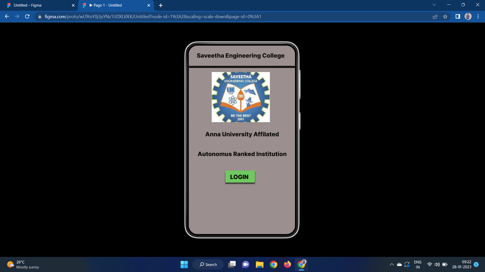
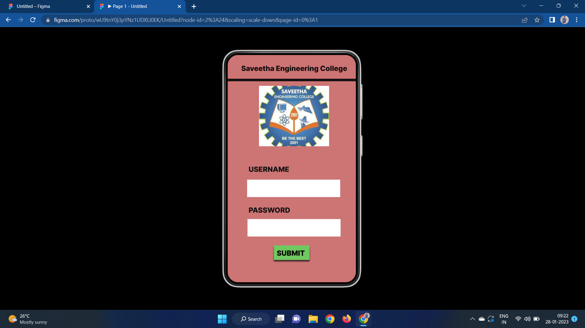
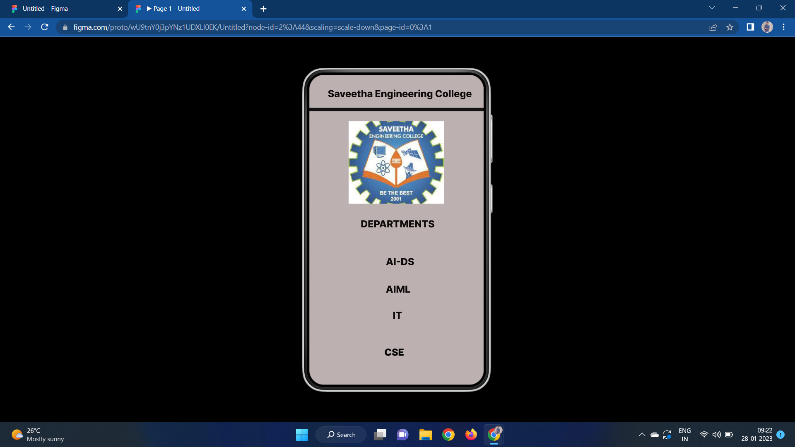

# Event Registration Web Application

## AIM:
To design, develop and deploy a web application for event registration.

## DESIGN STEPS:

### Step 1:
Create a new frame.

### Step 2:
Select any one preset size of your choice.

### Step 3:
Select the shapes you need.

### Step 4:
Import images as needed.

### Step 5:
Create pages based on your need and link them.

### Step 6:

Validate the HTML and CSS code.

### Step 6:

Publish the website in the given URL.

## DESIGN TOOL:
Figma

## code:
```
/* Home Page */

position: relative;
width: 360px;
height: 640px;
background: #9B8F8F;


/* Login Page */

position: relative;
width: 360px;
height: 640px;
background: #CD7474;

/* SAVEETHA ENGINEERING COLLEGE */

position: absolute;
width: 339px;
height: 57px;
left: 10px;
top: 15px;
font-family: 'Inter';
font-style: normal;
font-weight: 800;
font-size: 20px;
line-height: 24px;
text-align: center;
color: #090505;

/* DEPARTMENTS */

position: absolute;
width: 153px;
height: 24px;
left: 88px;
top: 9px;
font-family: 'Inter';
font-style: normal;
font-weight: 800;
font-size: 20px;
line-height: 24px;
text-align: center;
color: #0F0B0B;

/* AI-DS */

position: absolute;
width: 59px;
height: 24px;
left: 135px;
top: 9px;
font-family: 'Inter';
font-style: normal;
font-weight: 800;
font-size: 20px;
line-height: 24px;
text-align: center;
color: #0F0B0B;

/* AIML */

position: absolute;
width: 51px;
height: 24px;
left: 158px;
top: 431px;
font-family: 'Inter';
font-style: normal;
font-weight: 800;
font-size: 20px;
line-height: 24px;
text-align: center;
color: #0F0B0B;

/* IT */

position: absolute;
width: 20px;
height: 24px;
left: 154px;
top: 9px;
font-family: 'Inter';
font-style: normal;
font-weight: 800;
font-size: 20px;
line-height: 24px;
text-align: center;
color: #0F0B0B;

/* CSE */

position: absolute;
width: 41px;
height: 24px;
left: 137px;
top: 19px;
font-family: 'Inter';
font-style: normal;
font-weight: 800;
font-size: 20px;
line-height: 24px;
text-align: center;
color: #000000;

/* Line 3 */

position: absolute;
width: 360px;
height: 0px;
left: 0px;
top: 75px;
border: 7px solid #131111;

/* saveetha 3 */

position: absolute;
width: 197px;
height: 170px;
left: 81px;
top: 96px;
background: url(saveetha.jpg)
```

## OUTPUT:




## RESULT:
The program to design, develop and deploy a web application for event registration is completed successfully.